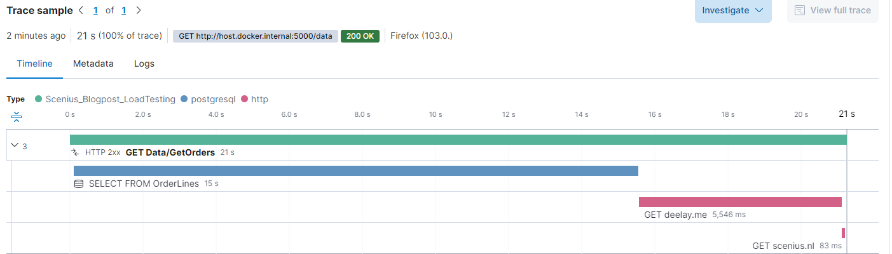
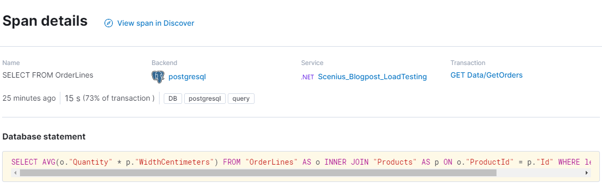
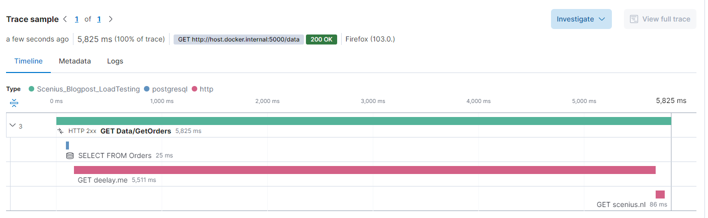
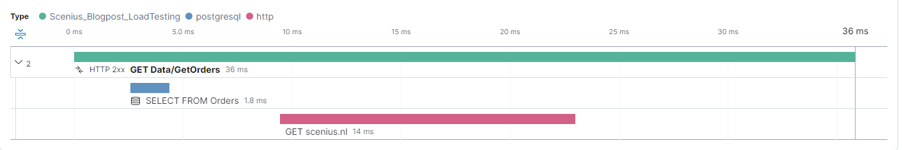
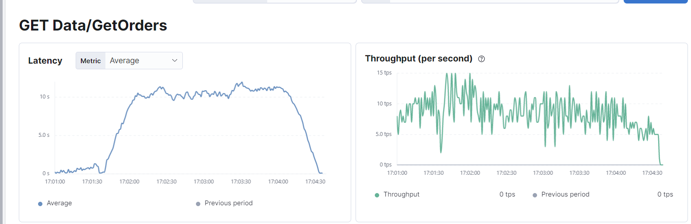
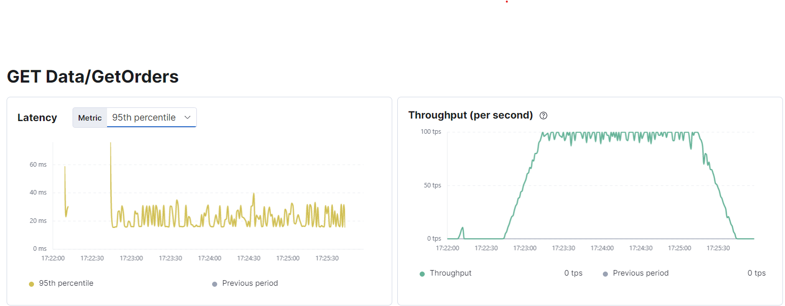

# Application Performance (-Monitoring) at Scenius

### Intro
At Scenius we claim, like most others, to provide performant and scalable software solution. However 'scalability' and 'performance' is for most a difficult concept to grasp. What defines 'scalable and performant' and should you care?
When developing or maintaining a software project it is important to continuously assess that the solution will be able to support the business objectives of today till the last day of the expected lifespan of the product. 
In this blogpost we will try to elaborate how we formulate the performance related non-functional requirements and how we validate and monitor that these requirements are met. This is also where load testing and application performance monitoring (APM) come in play.

### Should you care?
In short, yes, always, but to what extend differs greatly based on the objective of the software. Scalability and performance are measures of the efficiency of software, the former a measure of the effect and effort of both horizontally and vertically growing the application, and the later an indication of the amount of workloads the system can process.
Part of looking at the bigger picture at Scenius, is to identify flows in a system. Where a flow is often one or more user stories performed by a (virtual) user to accomplish a defined goal.  
At Scenius we have several customers active in ecommerce, so let's take a online payment as example for the remainder of this blogpost.

### Performance
Regardless of the number of customers you want to facilitate with your checkout, the performance of the application should be above acceptable. A good indication of application performance is the time it takes the application to respond to a action or request. 
For our example of an online payment it is important that the user is able to move forward in the flow so a snappy requirement is a must. 'Snappy' is subjective an immeasurable, that is why we measure latency of individual actions in milliseconds. We use the following internal guideline:
- Below 50ms: Excellent
- 50-100ms: Good
- 100-150ms: Acceptable
- 150-250ms: Arguable
- 250ms+: Unresponsive

There are some nuances to this list. For example when dealing with external integrations or geographical challenges. 
The the flow requires an inline API call to an external party that does not respond within an acceptable timeframe then it might become impossible to hit the non-functional requirement.
We do believe that it is the responsibility of the developing party to bring these limitations to attention of the customer so that they can be addressed by the integrating party.

When we perform our performance test we most often do this from a stable fiber connection to hyperscalers, not from our phones sitting in the train which is going through a tunnel. This is why we are critical with regards to the synthetic load-tests, we have to offset for the real world.

### Scalability
What is a scalable application? Simply put if the throughput has minimal impact on the latency. A mistake often made is when assumptions of scalability are made based on application performance throughout development, acceptance and pre-prod.
The application is perceived as fast, thus the assumption is made that it must be scalable, But when 10 users use the application simultaneously the application unusable. Now we have arrived at the second important non functional requirement, throughput. 
We express throughput in concurrent transactions per second (TPS), so if we have a TPS of 60 the application should be able to finish 60 checkout flows every second.
It is important to establish how many users you want to facilitate with the software solution.

Using our ecommerce example let's say you expect to sell 10.000 units every month, and you want to scale up to 100.000 transactions within 3 years.
Now we take a (realistic) worst case scenario, you sell a luxury gift-able product, it is the end of december and with the holidays coming up most employers clear the paychecks at the same day.  
Yielding us with 2500 transactions per hour for the first year and 25000 transactions after three years for this case. This boils down to 2.8TPS and 28TPS

For this example we would set 30+TPS as our non-function requirement. 

### Demonstration
In this repository we have setup a small project to illustrate how to test with k6 and identify potential bottlenecks. This test is purely for vertical scaling, we might do a blogpost in the future about how we facilitate our customers in the journey to the cloud, kubernetes and verifying horizontal scalability.
Ingredients of this test are:
- Example application: Simple application with a single slow endpoint
- Elasticsearch: The backing datastore for our APM data
- Elastic APM: The instrumentation tool used to monitor the performance of our app
- Kibana: Elastic's UI which can be used to visualize our APM data
- Postgres: The backing database for the example application

The sample application contains a single test endpoint simulating a slow database call, slow integration partner and a concurrency limit.

```	
[HttpGet]
public async Task<IActionResult> GetOrders()
{
    // Simulate slow database performance
    var orders = _db.OrderLines.Where(x => x.Product.Name.Length > 3).Average(x => x.Quantity * x.Product.WidthCentimeters);

    try
    {
        // Simulate concurrency issues
        await _concurrencyLatch.WaitAsync();
        // Simulate slow integration partner
        await _httpClient.GetAsync("https://deelay.me/5000/https://scenius.nl");
    }
    finally
    {
        _concurrencyLatch.Release();
    }

    return Ok(orders);
}
```

To establish a baseline we execute a single call from the browser.



First we'll take a look at the slow query. It took some time to find a slow query. What we are querying is a bit unusual, but finding something that was slow was more difficult then expected.



Clearly this is a major part of the request and already brings us well above an acceptable response-time.
We will postpone in to Postgres's EXPLAIN and fixing the query itself for later, for now the query will be replace with a different but performant one.



Having fixed our query we now see that the database is responding within 25 milliseconds. Sadly we are dependant on an external partner Deelay.me.
In the real world we usually we contact the vendor or partner and ask if this is expected and what we can do to fix it on their side. Otherwise queues, caches and mirroring can be applied.
Let's assume they fix the issue.



That's better, we have a call with very little latency. 

**Loadtesting**  
At this point we have a endpoint with a low latency, now it is time to see how it works under load.
For this purpose we will use k6, one of many available load testing tools. The script included in repository simulates 100 virtual users hitting the site repeatedly with a 1000ms iteration delay.

Let's say for this application the requirement is 30TPS @ 100 users with a maximum of 95th percentile of 150MS response. We will instruct k6 to scale up to 100 users for 3 minutes.
```
stages: [
    { duration: '30s', target: 100 }, // Ramp up
    { duration: '2m', target: 100 }, // Hold
    { duration: '30s', target: 0 }, // Ramp down
],
thresholds: {
    'http_req_duration': ['p(95)<150'], // 99% of requests must complete below 1.5s
}
```
After the test we get the following result from k6.

```
running (3m00.9s), 000/100 VUs, 1536 complete and 0 interrupted iterations
default ✓ [======================================] 000/100 VUs  3m0s

data_received..................: 680 kB 3.8 kB/s
data_sent......................: 129 kB 713 B/s
http_req_blocked...............: avg=33.55µs  min=0s      med=0s       max=1.19ms  p(90)=0s     p(95)=505.82µs
http_req_connecting............: avg=31.26µs  min=0s      med=0s       max=1.19ms  p(90)=0s     p(95)=505.49µs
✗ http_req_duration..............: avg=8.98s    min=78.91ms med=10.26s   max=12.06s  p(90)=11.24s p(95)=11.4s
{ expected_response:true }...: avg=8.98s    min=78.91ms med=10.26s   max=12.06s  p(90)=11.24s p(95)=11.4s
http_req_failed................: 0.00%  ✓ 0        ✗ 1536
http_req_receiving.............: avg=693.39µs min=0s      med=557.05µs max=14.29ms p(90)=1.56ms p(95)=1.86ms
http_req_sending...............: avg=5.01µs   min=0s      med=0s       max=617.4µs p(90)=0s     p(95)=0s
http_req_tls_handshaking.......: avg=0s       min=0s      med=0s       max=0s      p(90)=0s     p(95)=0s
http_req_waiting...............: avg=8.98s    min=78.49ms med=10.26s   max=12.06s  p(90)=11.24s p(95)=11.4s
http_reqs......................: 1536   8.492113/s
iteration_duration.............: avg=9.99s    min=1.07s   med=11.27s   max=13.08s  p(90)=12.25s p(95)=12.41s
iterations.....................: 1536   8.492113/s
vus............................: 3      min=3      max=100
vus_max........................: 100    min=100    max=100
ERRO[0181] some thresholds have failed
```
To verify this we can also check Elastic APM


To the surprise of those who only performed single user tests this simple synthetic workload destroyed the application with an average response time of 8980 milliseconds. The application has failed to meet the combined performance requirement of latency and throughput.
As illustrated earlier this same endpoint responds in less than 20 milliseconds when a single user hits it, thus if throughput was not taken into account it would have passed only to explode in production.   
We have simulated a concurrency issue with the lock, but this can have many causes like table-locking or poorly performing integrations. When there is correlation between increaing the VU's and 

Let's retry this without a concurrency limitation. The database seems to have settled at 2.5-4ms for our query and we will cache the result from the HTTP call since we know it returns mostly static data.

```
running (3m00.5s), 000/100 VUs, 14694 complete and 0 interrupted iterations
default ✓ [======================================] 000/100 VUs  3m0s

     data_received..................: 1.4 MB 7.5 kB/s
     data_sent......................: 1.2 MB 6.8 kB/s
     http_req_blocked...............: avg=5.46µs  min=0s     med=0s      max=1.4ms    p(90)=0s      p(95)=0s
     http_req_connecting............: avg=3.57µs  min=0s     med=0s      max=1.24ms   p(90)=0s      p(95)=0s
   ✓ http_req_duration..............: avg=16.66ms min=9.76ms med=15.92ms max=100.23ms p(90)=17.49ms p(95)=23.63ms
       { expected_response:true }...: avg=16.66ms min=9.76ms med=15.92ms max=100.23ms p(90)=17.49ms p(95)=23.63ms
     http_req_failed................: 0.00%  ✓ 0         ✗ 14694
     http_req_receiving.............: avg=93.52µs min=0s     med=0s      max=9.04ms   p(90)=410.5µs p(95)=515.7µs
     http_req_sending...............: avg=5.91µs  min=0s     med=0s      max=920.1µs  p(90)=0s      p(95)=0s
     http_req_tls_handshaking.......: avg=0s      min=0s     med=0s      max=0s       p(90)=0s      p(95)=0s
     http_req_waiting...............: avg=16.56ms min=9.52ms med=15.82ms max=100.23ms p(90)=17.28ms p(95)=23.62ms
     http_reqs......................: 14694  81.427997/s
     iteration_duration.............: avg=1.02s   min=1.01s  med=1.02s   max=1.1s     p(90)=1.03s   p(95)=1.03s
     iterations.....................: 14694  81.427997/s
     vus............................: 2      min=2       max=100
     vus_max........................: 100    min=100     max=100
```


As we can see k6 reports 81TPS and this is confirmed by Elastic. Since we have 100VU with a 1 second cycle delay this beyond acceptable and after making the required changes our example application now passes.

### Monitoring
Using Elastic's dashboards it is possible to find slow endpoints, identify the root cause and report on the impact on the users.
Kibana also supports setting up alerts for latency increases and other parameters which might be indicative of a poorly performing endpoint.
There are lots of other solutions which also serve the same purpose, namely validating that the non-functional requirements set and validated in the past continue to be met even after active development has ended.
We at Scenius take operational monitoring very serious, especially since we have a lot of integrations which can significantly impact the services of our customers. Identifying poorly performing integrations and alerting the vendors can prevent service outages.

### Conclusion
Ensuring that the applications within your IT landscape are capable of supporting their business objectives is crucial. 
Although often overlooked in the fast moving scale-up mindset non-functional requirements play a significant role, especially when the the growth of the user base outpaces the limitations of the concurrency. 
We recommend identifying all vital flows and setting a non-functional requirement stating the expected TPS with a P95 latency threshold and request periodic reporting on this from your software vendor.
